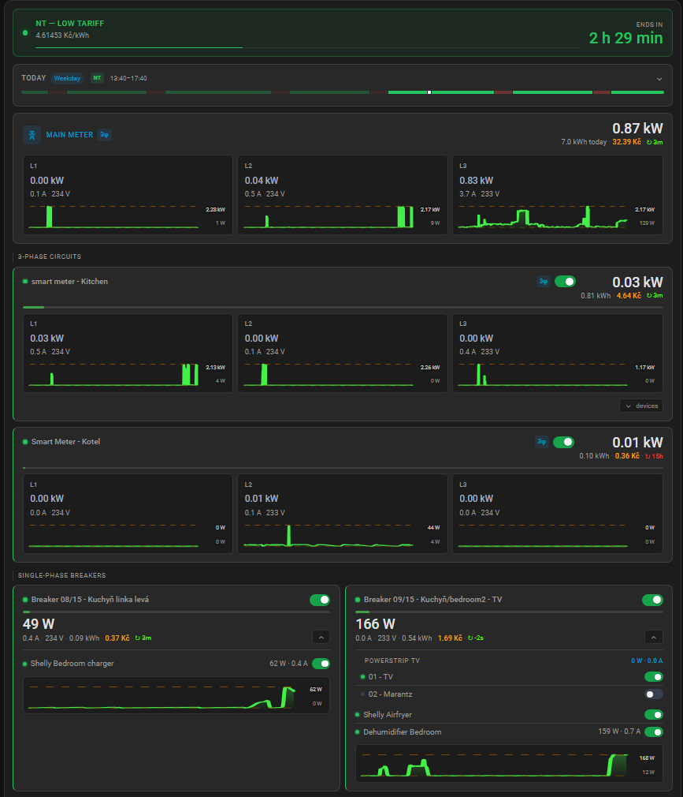
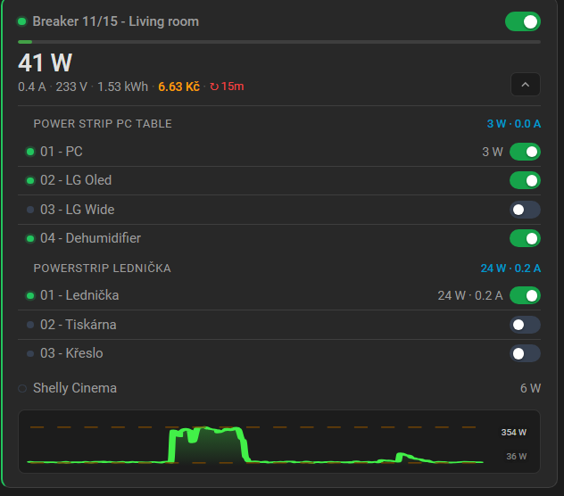

# ⚡ Electricity Panel Card

A Home Assistant custom Lovelace card for managing and monitoring your home's electrical panel — circuit breakers, per-circuit power / current / daily energy, sub-device hierarchy, and HDO time-of-use tariff integration.

Configured entirely through a built-in GUI editor. No YAML editing required.

---

## Screenshots


*Main meter, HDO tariff bar, 3-phase circuits with sparkline graphs and single-phase breakers*


*Expanded circuit with device list, load bar and last-updated badge*

---

## Features

- **Panel overview** — main 3-phase meter plus all circuit breakers in one view
- **Per-circuit metrics** — live watts (W), amperes (A), and kWh today
- **Load bar** — visual load indicator relative to the breaker's rated current
- **Remote toggle** — turn individual circuits on/off directly from the card
- **Critical circuit protection** — lock icon replaces the toggle for circuits that must never be switched off accidentally
- **3-phase circuits** — rendered in their own row with a 3φ badge
- **Device hierarchy** — expand any circuit to see the devices wired behind it, including Shelly multi-channel support (4PM, 2PM)
- **HDO tariff bar** — optional NT/VT status with countdown to the next switch
- **GUI config editor** — full visual editor with entity searchboxes; no manual YAML required

---

## Requirements

### Home Assistant

- Home Assistant 2024.1 or newer

### Smart devices

The card works with any entities exposed to HA. Tested with:

| Device | Usage |
|---|---|
| Tuya smart circuit breakers | Switch + power + current + energy entities per breaker |
| Shelly 1PM / 2PM / 4PM | Per-device or per-channel power and current monitoring |
| Any HDO integration | `switch.hdo` + next-change sensors |

### HACS

Install the card through [HACS](https://hacs.xyz) as a **Frontend** resource, or add `dist/electricity-panel-card.js` to your Lovelace resources manually.

---

## Installation

### Via HACS (recommended)

1. Open HACS → Frontend → **+ Explore & download repositories**
2. Search for **Electricity Panel Card** and download
3. Reload your browser
4. Add the card to any dashboard via the card picker

### Manual

1. Download `electricity-panel-card.js` from the [latest release](../../releases/latest)
2. Copy it to `config/www/electricity-panel-card.js`
3. In HA go to **Settings → Dashboards → Resources** and add:
   ```
   /local/electricity-panel-card.js
   ```
4. Reload the browser

---

## Configuration

All configuration is done through the built-in card editor — click **Edit** on the card in the dashboard.

The editor has three sections:

**Main meter** — entity pickers for L1/L2/L3 power, L1/L2/L3 current, and energy today. Leave empty if you don't have a smart main meter.

**HDO** — entity pickers for the tariff switch, next-high and next-low sensors, and the workday sensor. The HDO bar is hidden if no switch is configured.

**Circuits** — add and configure breakers. For each circuit:
- Name and ID
- 1-phase or 3-phase selector
- Critical flag (replaces toggle with lock icon)
- Rated current in A (used for the load bar)
- Entity pickers for switch, power (W), current (A), energy (kWh today), voltage (V)
- **Devices** — sub-list of devices behind the breaker. Each device can optionally have a switch and measurement entities. Multi-channel devices (Shelly 4PM etc.) support individual channels.

---

## Suggested entity naming convention

To keep config readable, rename your Tuya/Shelly entities in HA to a consistent pattern:

```
switch.circuit_08_kitchen_left
sensor.circuit_08_kitchen_left_power      (W)
sensor.circuit_08_kitchen_left_current    (A)
sensor.circuit_08_kitchen_left_energy     (kWh today)

switch.shelly_heating_zone_1
sensor.shelly_heating_zone_1_power
```

---

## Examples

See the [`examples/`](examples/) folder for a standalone HDO dashboard YAML view (uses `custom:button-card` + `card-mod`).

---

## Development

```bash
npm install
npm run build      # build to dist/
npm run watch      # rebuild on file changes
```

The output `dist/electricity-panel-card.js` is committed to the repository — HACS requires this.

---

## License

MIT — see [LICENSE](LICENSE).
