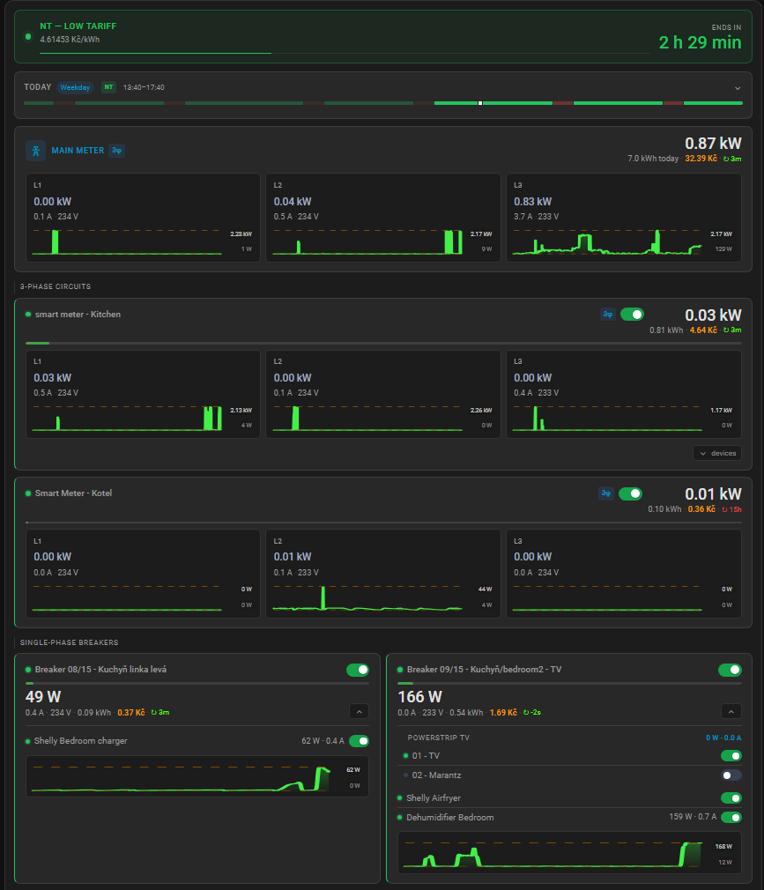
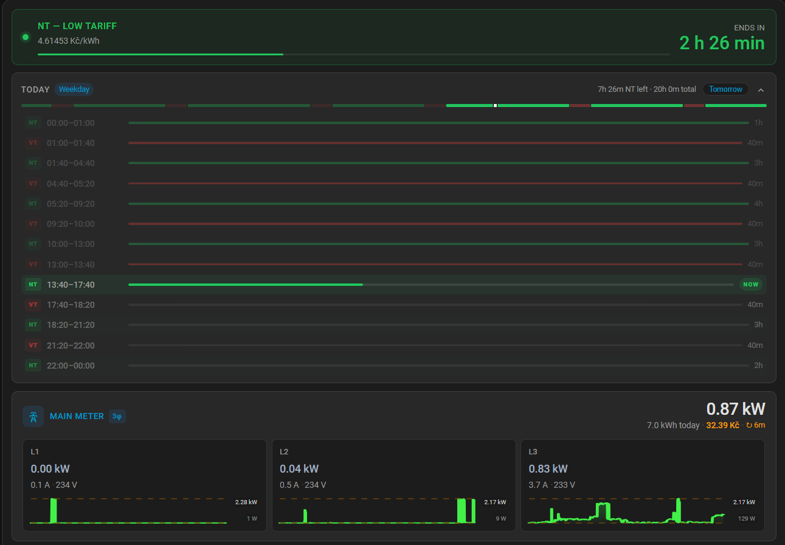
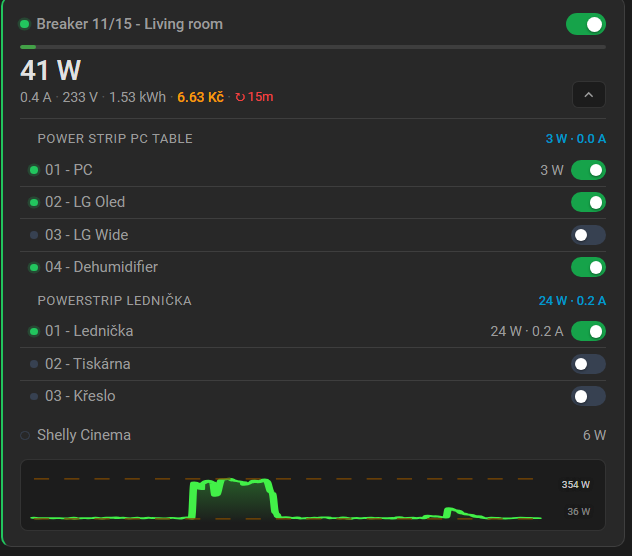
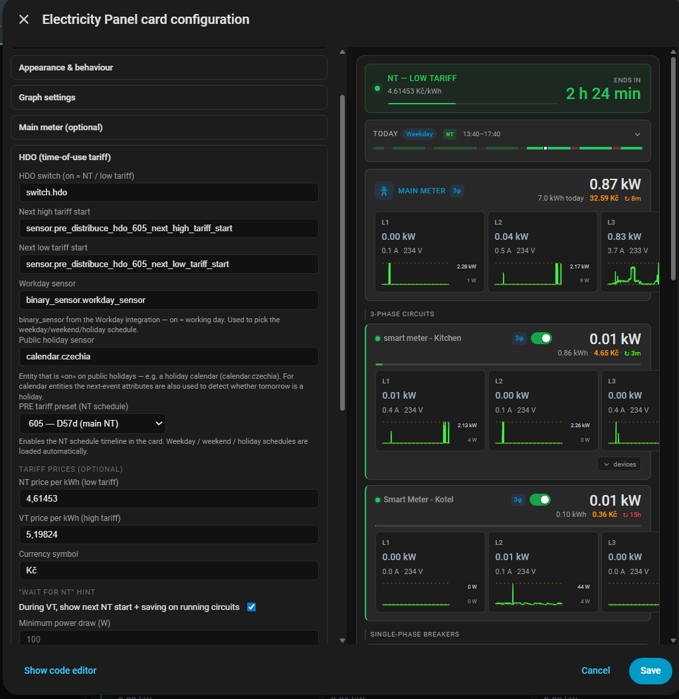

# ⚡ Electricity Panel Card

A Home Assistant custom Lovelace card for managing and monitoring your home's electrical panel — circuit breakers, per-circuit power / current / daily energy, sub-device hierarchy, and HDO time-of-use tariff integration.

Configured entirely through a built-in GUI editor. No YAML editing required.

---

## Screenshots


*Main meter with sparkline graphs, HDO tariff bar with countdown, 3-phase circuit and single-phase breakers*


*Expanded daily NT/VT schedule with timeline, current slot progress and tomorrow view*


*Expanded circuit with device list, multi-channel device, load bar and daily cost*


*Built-in visual editor — HDO section with tariff preset, holiday sensor and prices*

---

## Features

- **Panel overview** — main 3-phase meter plus all circuit breakers in one view
- **Per-circuit metrics** — live watts (W), amperes (A), and kWh today
- **Daily cost tracking** — NT/VT-split cost since midnight per circuit and for the main meter
- **Load bar** — visual load indicator relative to the breaker's rated current, with an overload pulse at 95 %
- **Remote toggle** — turn individual circuits on/off directly from the card, with optional confirmation dialog
- **Critical circuit protection** — lock icon replaces the toggle for circuits that must never be switched off accidentally
- **3-phase circuits** — rendered in their own row with a 3φ badge and per-phase cells
- **Device hierarchy** — expand any circuit to see the devices wired behind it, including Shelly multi-channel support (4PM, 2PM)
- **HDO tariff bar** — optional NT/VT status with countdown to the next switch
- **Holiday-aware schedule** — workday sensor + public holiday sensor (e.g. `calendar.czechia`) pick the correct weekday/weekend/holiday NT programme, including tomorrow's view
- **"Wait for NT" hint** (opt-in) — during VT, running circuits show the next NT start and the percentage saving
- **Sparkline power graphs** — time-aligned history graphs on main meter and circuit phase cells
- **Theming** — built-in dark design, or `follow_theme: true` to adapt to the active HA theme
- **Panel view** (opt-in) — `view: panel` draws the breakers as modules on a DIN rail, the way the physical board looks: lever, load level, phase stripe, position number. Tap a module for its detail, tap several to line their graphs up on one axis
- **GUI config editor** — full visual editor with entity searchboxes; no manual YAML required

---

## Requirements

### Home Assistant

- Home Assistant 2024.1 or newer

### Smart devices

The card works with any entities exposed to HA. Tested with:

| Device | Usage |
|---|---|
| Tuya smart circuit breakers | Switch + power + current + energy entities per breaker |
| Shelly 1PM / 2PM / 4PM | Per-device or per-channel power and current monitoring |
| Any HDO integration | `switch.hdo` + next-change sensors |
| Workday integration | weekday / weekend / holiday schedule switching |
| Holiday calendar (e.g. `calendar.czechia`) | public holiday detection for today and tomorrow |

### HACS

Install the card through [HACS](https://hacs.xyz) as a **Frontend** resource, or add `dist/electricity-panel-card.js` to your Lovelace resources manually.

---

## Installation

### Via HACS (recommended)

1. Open HACS → Frontend → **+ Explore & download repositories**
2. Search for **Electricity Panel Card** and download
3. Reload your browser
4. Add the card to any dashboard via the card picker

### Manual

1. Download `electricity-panel-card.js` from the [latest release](../../releases/latest)
2. Copy it to `config/www/electricity-panel-card.js`
3. In HA go to **Settings → Dashboards → Resources** and add:
   ```
   /local/electricity-panel-card.js
   ```
4. Reload the browser

---

## Configuration

All configuration is done through the built-in card editor — click **Edit** on the card in the dashboard.

The editor sections:

**Layout** — `classic` (default) or `panel`. See [Panel view](#panel-view) below.

**Appearance & behaviour** — follow HA theme colours, debug logging.

**Graph settings** — history window (1–24 h), sparkline colour/labels/reference lines, per-area visibility toggles, last-updated age badge.

**Main meter** — entity pickers for L1/L2/L3 power, L1/L2/L3 current, per-phase voltage, and energy today. Leave empty if you don't have a smart main meter.

**HDO** — entity pickers for the tariff switch, next-high and next-low sensors, the workday sensor, and a public holiday sensor (e.g. a national holiday calendar such as `calendar.czechia` — for calendar entities the card also detects whether *tomorrow* is a holiday). PRE tariff presets, NT/VT prices, and the optional "wait for NT" hint with a power threshold.

**Circuits** — add and configure breakers. For each circuit:
- Name and ID
- 1-phase or 3-phase selector
- Critical flag (replaces toggle with lock icon)
- Confirmation flag (ask before toggling)
- Rated current in A (used for the load bar)
- Position in the board and Phase — only used by panel view
- Entity pickers for switch, power (W), current (A), energy (kWh today), voltage (V) — plus per-phase entities for 3φ circuits
- **Devices** — sub-list of devices behind the breaker. Each device can optionally have a switch and measurement entities. Multi-channel devices (Shelly 4PM etc.) support individual channels.

### Panel view

`view: panel` swaps the meter card and circuit grid for a DIN rail: one module
per breaker, three module widths for a 3-phase breaker, with the lever, the
load level rising in the module body, the phase stripe and the position number.
The schedule and costs block moves below the rail, and the day's tariff
timeline moves up next to the tariff bar — "is it cheap now" and "what is
drawing" are the glance-level questions, the schedule table is not.

Tap a module to expand its detail below the rail: full numbers, a large graph
and the devices wired behind that breaker. Tap several modules and their graphs
line up side by side on one time axis, with a **shared Y axis** toggle (on by
default) so the curves are actually comparable — that is the difference between
"both look busy" and "the boiler draws thirty times what the fridge does".
A 3-phase module shows L1/L2/L3 side by side, also on one shared scale.

It needs two extra fields per circuit. Without them nothing breaks: circuits
keep their config order and simply have no phase stripe.

```yaml
type: custom:electricity-panel-card
view: panel                  # classic is the default
title: Distribution board

panel:
  rail_size: 12              # module positions per rail row (default 12)
  main_breaker: 25           # main breaker rating in A (default 25)
  module_spark: true         # micro graph inside each module (default true)
  show_main: true            # show the main-breaker module (default true)

circuits:
  - id: kitchen_left
    name: Kitchen worktop left
    position: "08"           # printed on the module; also sorts the rail
    phase: L1                # colours the stripe at the bottom
    max_current: 16          # drives how high the load level rises
    power: sensor.shelly_kitchen_power
    current: sensor.shelly_kitchen_current
    energy: sensor.shelly_kitchen_energy
    switch: switch.shelly_kitchen

  - id: hob
    name: Hob
    position: "V1"
    phases: 3                # a 3-phase breaker is 3 modules wide
    max_current: 25
    power_l1: sensor.hob_l1_power
    power_l2: sensor.hob_l2_power
    power_l3: sensor.hob_l3_power
```

Positions sort naturally, so `01` comes before `08` before `10`, and lettered
positions like `V1` or `K1` come after the numbered ones. A 3-phase module never
straddles two rails — if it would overflow it moves to the next rail whole, like
the physical thing.

Note on the lever colour: red means ON. That is the European MCB convention (the
red field means "live") and it is a deliberate exception to the card's rule that
red means high tariff.

---

## Suggested entity naming convention

To keep config readable, rename your Tuya/Shelly entities in HA to a consistent pattern:

```
switch.circuit_08_kitchen_left
sensor.circuit_08_kitchen_left_power      (W)
sensor.circuit_08_kitchen_left_current    (A)
sensor.circuit_08_kitchen_left_energy     (kWh today)

switch.shelly_heating_zone_1
sensor.shelly_heating_zone_1_power
```

---

## Examples

See the [`examples/`](examples/) folder for a standalone HDO dashboard YAML view (uses `custom:button-card` + `card-mod`).

---

## Recommended automations

The card is intentionally a **visual layer only** — it doesn't call services or fire alerts itself, so nothing it shows can accidentally trip a breaker or send a notification on its own. Pair it with a few small Home Assistant automations instead; here are the ones that map directly to what the card already surfaces (load bar, HDO bar).

**Boiler / water heater on NT** — shift a big flexible load to the cheap tariff window instead of watching the HDO bar manually:

```yaml
automation:
  - alias: "Boiler on at NT start"
    trigger:
      - platform: state
        entity_id: switch.hdo          # your HDO switch — see Requirements table
        to: "on"                       # adjust to whichever state your switch reports as NT
    condition:
      - condition: state
        entity_id: input_boolean.boiler_auto   # optional manual override toggle
        state: "on"
    action:
      - service: switch.turn_on
        target:
          entity_id: switch.boiler

  - alias: "Boiler off at NT end"
    trigger:
      - platform: state
        entity_id: switch.hdo
        to: "off"
    action:
      - service: switch.turn_off
        target:
          entity_id: switch.boiler
```

**Circuit overload notification** — mirrors the card's load-bar pulse at 95 % of rated current, but as a push notification instead of something you have to be looking at the dashboard to notice:

```yaml
automation:
  - alias: "Circuit 08 — approaching overload"
    trigger:
      - platform: numeric_state
        entity_id: sensor.circuit_08_kitchen_left_current
        above: 14.25            # 95 % of a 15 A breaker — adjust to your rating
        for: "00:02:00"         # debounce brief spikes
    action:
      - service: notify.mobile_app_your_phone
        data:
          title: "⚡ Circuit Kitchen — near overload"
          message: >
            {{ states('sensor.circuit_08_kitchen_left_current') }} A
            (limit 15 A)
```

**Main breaker overload** — same idea for the whole-panel main breaker, checking all three phases:

```yaml
automation:
  - alias: "Main breaker — approaching overload"
    trigger:
      - platform: template
        value_template: >
          {{ [states('sensor.main_meter_current_l1')|float(0),
              states('sensor.main_meter_current_l2')|float(0),
              states('sensor.main_meter_current_l3')|float(0)] | max > 22.8 }}
        for: "00:01:00"
    action:
      - service: notify.mobile_app_your_phone
        data:
          title: "⚡ Main breaker — near overload"
          message: "One phase has exceeded 95 % of its rated current."
```

Adjust entity IDs, thresholds, and the `notify.*` service to your own setup — these are starting points, not drop-in config.

---

## Development

```bash
npm install
npm run typecheck  # tsc --noEmit only
npm run build      # typecheck + build to dist/
npm run watch      # rebuild on file changes
npm run deploy     # build + bump HA resource URL (dev workflow, needs .env)
npm run bump       # bump HA resource URL only, no rebuild (after HACS update)
```

For `deploy` / `bump`, copy `.env.example` to `.env` and fill in `HA_URL` and `HA_TOKEN`.

The output `dist/electricity-panel-card.js` is committed to the repository — HACS requires this.

---

## License

MIT — see [LICENSE](LICENSE).
